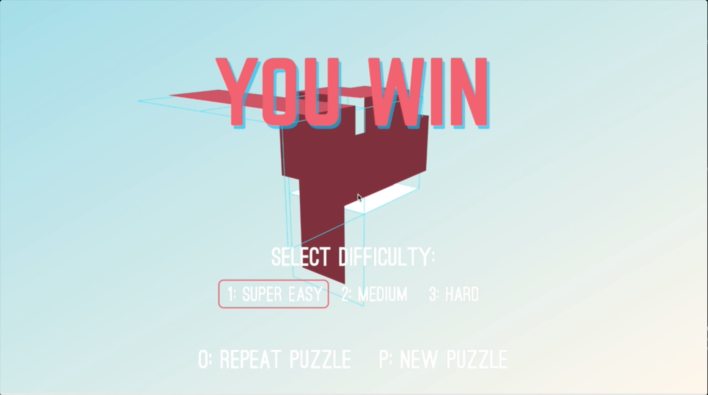

# **Propuga**

Propuga is an online puzzle game where each puzzle is procedurally generated. This means that rather than designing every playable puzzle, I’ve designed a program that will generate an infinite number of challenging puzzles.

## Gameplay Rules and Design

In Propuga, players can jump from a face to any adjacent face, but every time they leave a block, it disappears. The goal of the puzzle is to jump from face to face and touch every block just once so they all disappear. 

When designing my Propuga, I aimed for a product that was simple and enjoyable for anyone, but has some interesting inherent technical challenge as well as fun visual design features. My main motivation for building Propuga for the web is so that anyone can pull up the page and play a quick game to pass the time. I find that puzzle games are a fun quick source of entertainment, but a limited number of puzzle designs tends to result in limited replay value. Ideally, I wanted to create a puzzle game with as much emergent gameplay as possible.

### Creating a Graph Representation

This 3D puzzle can be represented as a modified Hamiltonian path problem. Say we represent a puzzle as a graph where each face is has two symmetric sides that share an “index” and each side can be represented as a graph node connected to sides that are traversable in the puzzle. A solvable puzzle has a graph representation such that there is a path that contains every “index” only once. 

This Hamiltonian path check is performed at every block generation to allow for complex paths where for example: a new generation creates a loop that blocks an old valid path, but creates a new more interesting path in the process. Because this project doesn’t necessarily include huge numbers of generations, repeating these operations is harmless and allow for better generation.

My core puzzle generation algorithm involves random neighbor generations under constraints based on all previous generations. Since purely random generation may result in overly simple puzzles that bias in one direction such that players face very few junctions, my algorithm introduces a forced biasing against any significant global generation direction. This forced biasing effect is more likely to lead to puzzles that wrap or fold on themselves for more tricky solutions that may take several tries to find.

Not only was my goal to make puzzles that have solutions, but also puzzles that are not trivial to solve.

### Other Screenshots

